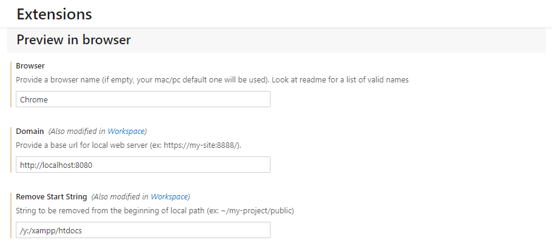
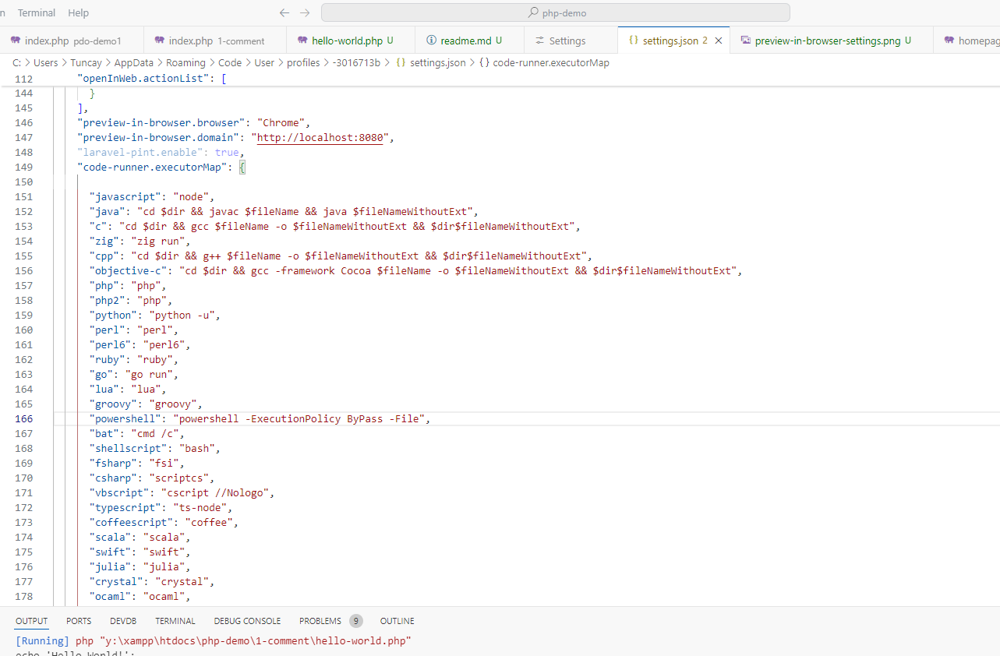
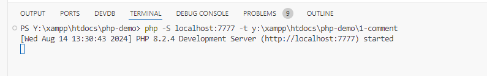
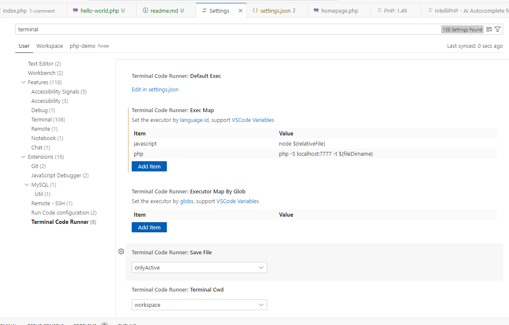

- [Local Server Php Dosyaların Çalıştırılması](#local-server-php-dosyaların-çalıştırılması)
- [Php exe ile çalıştırmak için](#php-exe-ile-çalıştırmak-için)
- [Terminal Code Runner ile komutu satırından server ile çalıştırılması](#terminal-code-runner-ile-komutu-satırından-server-ile-çalıştırılması)

# Local Server Php Dosyaların Çalıştırılması

➖ dosyanın içindeyken `preview in browser` yapılırak, localhostda ilgili dosya browser da açılır.

➖ preview in browser eklentisinin ayarları

# Php exe ile çalıştırmak için

➖ dosya içindeyken f1 tuşundan işlemlerden run code seçerek çalıştırırız.

# Terminal Code Runner ile komutu satırından server ile çalıştırılması

➖ terminal code runner server çalıştırma komutu

➖ terminal code runner ayarlar

